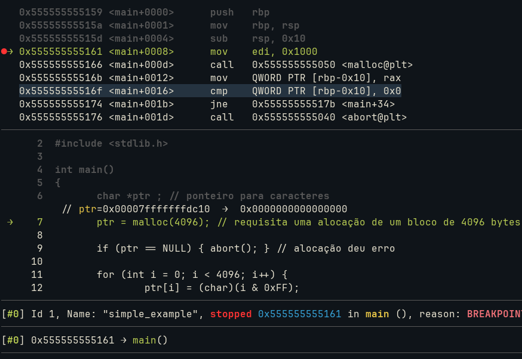
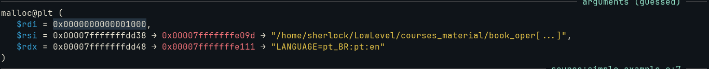
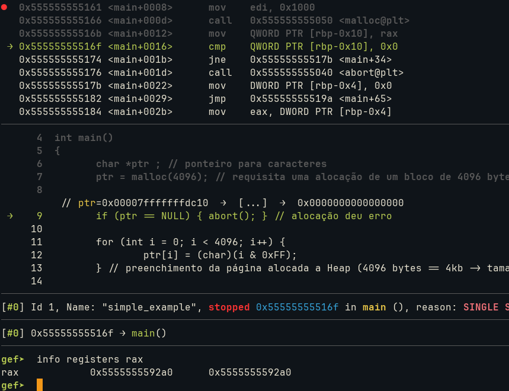

# (PT-BR) Alocação de Memória Dinâmica

A alocação de memória dinâmica é uma das formas mais comuns de gerenciamento de memória utilizadas por programas em execução.

Seu objetivo é permitir que blocos de memória sejam requisitados durante a execução do processo, conforme a necessidade da aplicação. À medida que o programa solicita memória, novos blocos são alocados em seu espaço de endereçamento virtual, especificamente no segmento **Heap**. Quando esses blocos deixam de ser necessários, devem ser liberados para que possam ser reutilizados posteriormente.

Em linguagens de baixo nível, como C e C++, é responsabilidade do programador liberar explicitamente a memória alocada quando ela não for mais necessária. Em processos de longa duração, como servidores web e outros serviços, a alocação contínua de memória sem a sua posterior liberação pode causar desperdício de recursos e, eventualmente, levar ao esgotamento da memória disponível.

---

## Exemplo (`./simple_example.c`)

Ao executar nosso programa em C, criado para demonstrar o mecanismo de alocação dinâmica de memória, podemos observar os principais elementos ilustrados na Figura 1.

### Figura 1 — Visão geral da execução



No frame correspondente à função **main**, localizado na pilha de execução (*stack*), observamos a preparação da chamada à função **malloc()**. O valor **4096** é passado como argumento por meio do registrador **RDI**, conforme definido pela ABI do sistema. Em hexadecimal, esse valor corresponde a **0x1000**.

Os argumentos da chamada podem ser observados na Figura 2.

### Figura 2 — Argumento passado para malloc()



Quando a instrução:

```asm
call malloc
```

é executada, ocorre uma chamada de função que cria um novo contexto de execução. Durante esse processo, a função **malloc()** passa a executar seu próprio frame na pilha.

De acordo com a ABI System V AMD64 utilizada nos sistemas Unix-like, o valor de retorno de uma função é armazenado no registrador **RAX**. No caso de **malloc()**, esse valor corresponde ao endereço inicial do bloco contíguo de memória requisitado, que será posteriormente atribuído ao ponteiro **ptr**.

Esse comportamento pode ser observado na Figura 3.

### Figura 3 — Valor retornado por malloc()



Após o retorno da função **malloc()**, o endereço contido em **RAX** é copiado para a variável local **ptr**, que está armazenada na pilha. Dessa forma:

* `&ptr` representa o endereço da variável ponteiro na **Stack**;
* `ptr` representa o endereço inicial do bloco alocado na **Heap**;
* `*ptr` representa o conteúdo armazenado no primeiro byte desse bloco de memória.